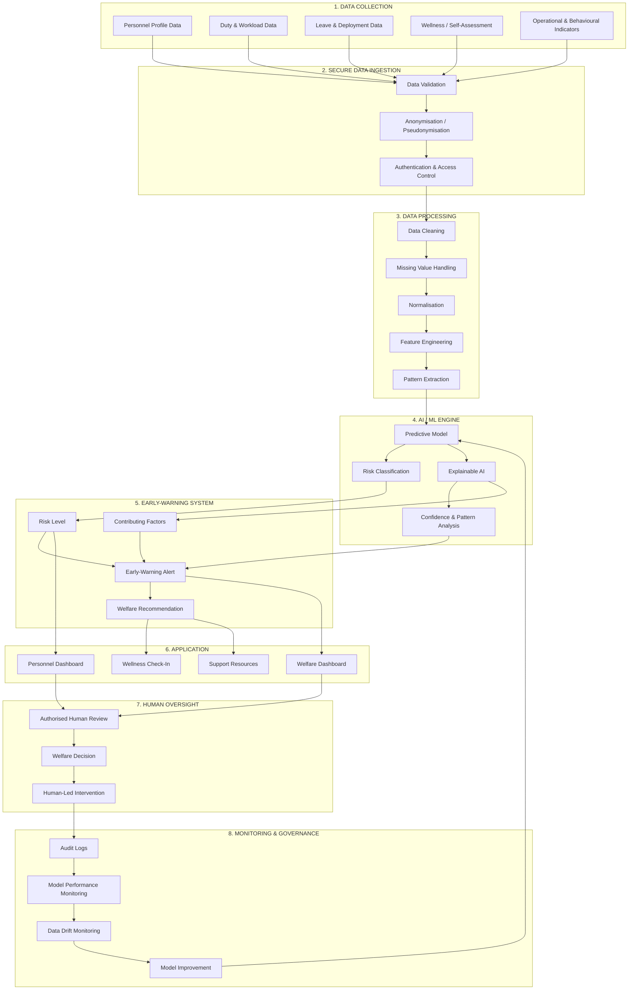
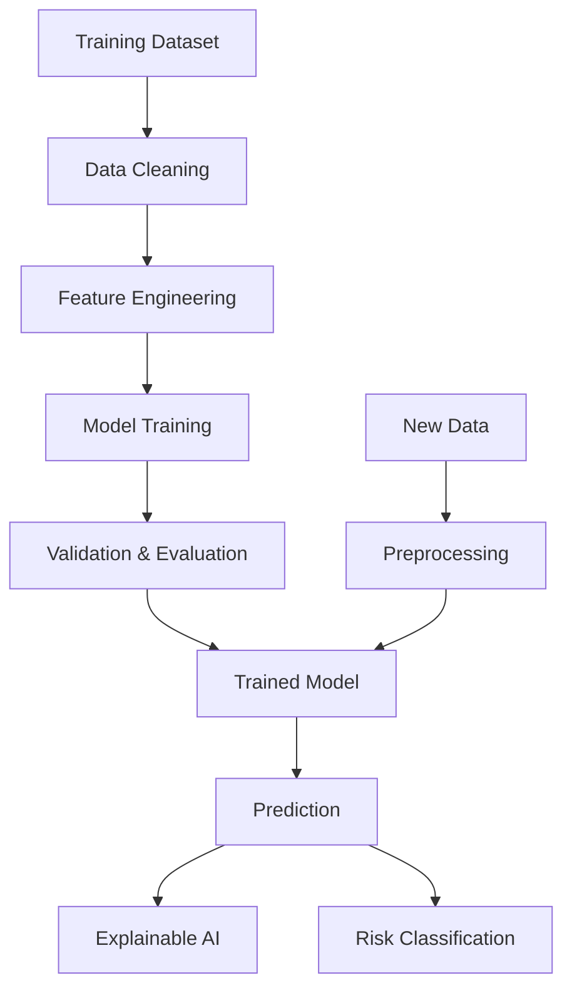
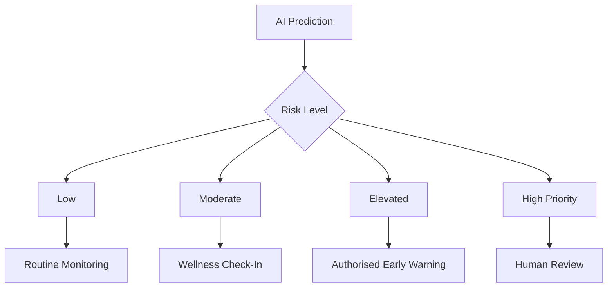
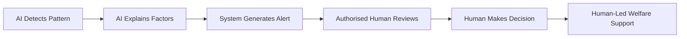
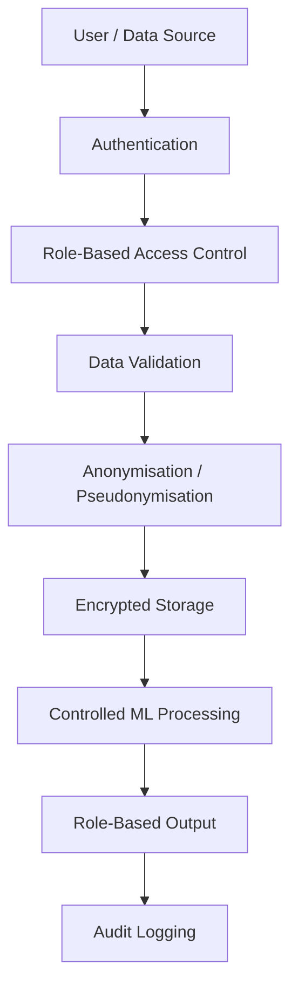

<h1>MANRAKSH</h1>
<h3>AI-Based Predictive Personnel Stress &amp; Welfare Monitoring System</h3>

  <b>“Detect Early. Support Privately. Protect Always.”</b>

 

## Problem Statement

Uniformed personnel work in demanding environments that may involve prolonged duty hours, irregular schedules, operational pressure, deployment, limited recovery time, and other occupational stressors.

Conventional welfare mechanisms may rely heavily on self-reporting or manual observation, which can make it difficult to identify emerging patterns at an early stage.

The proposed system uses **Artificial Intelligence and Machine Learning to identify patterns associated with personnel stress and welfare risk**, providing early warnings and decision-support information to authorised personnel.

The system is intended to support welfare monitoring and early intervention while keeping final welfare decisions under appropriate human supervision.

---

# Proposed Solution

The proposed platform integrates personnel information, workload patterns, duty and deployment information, leave patterns, and voluntary wellness inputs into a secure analytical pipeline.

The system:

* Collects relevant personnel and operational indicators
* Preprocesses and validates incoming data
* Extracts meaningful features
* Uses an AI/ML model to identify stress and welfare-risk patterns
* Classifies the detected risk level
* Identifies contributing factors using explainable AI
* Generates appropriate early-warning alerts
* Provides welfare-oriented recommendations
* Allows authorised personnel to review the information
* Supports human-led welfare intervention

The system does **not** treat an AI prediction as a medical diagnosis. Its purpose is to provide an early-warning and decision-support mechanism.

---

# Solution Architecture

---

# System Workflow

The system follows a continuous pipeline from data collection to human-led welfare support.

```mermaid
flowchart LR

    C["Data Collection"]
    P["Preprocessing"]
    F["Feature Engineering"]
    M["AI / ML Prediction"]
    R["Risk Classification"]
    X["Explainable Risk Factors"]
    A["Early-Warning Alert"]
    H["Human Review"]
    W["Welfare Support"]

    C --> P
    P --> F
    F --> M
    M --> R
    R --> X
    X --> A
    A --> H
    H --> W
```

### Workflow Stages

| Stage                   | Function                                                                         |
| ----------------------- | -------------------------------------------------------------------------------- |
| **Data Collection**     | Collect relevant personnel, workload, deployment, leave, and wellness indicators |
| **Preprocessing**       | Clean, validate, normalise, and prepare the data                                 |
| **Feature Engineering** | Convert raw information into meaningful analytical features                      |
| **AI/ML Prediction**    | Identify patterns associated with stress and welfare risk                        |
| **Risk Classification** | Categorise the predicted level of concern                                        |
| **Explainability**      | Identify the major factors contributing to the prediction                        |
| **Early Warning**       | Notify authorised users when elevated patterns are detected                      |
| **Human Review**        | Allow authorised personnel to interpret the situation in context                 |
| **Welfare Support**     | Enable appropriate human-led intervention or support                             |

---

# AI / ML Component

The AI/ML layer forms the predictive core of the system.

It analyses relevant features such as:

| Feature Category        | Examples                                                |
| ----------------------- | ------------------------------------------------------- |
| **Workload**            | Duty hours, workload frequency, overtime patterns       |
| **Duty Schedule**       | Shift irregularity, night-duty frequency                |
| **Deployment**          | Deployment duration, recent deployment activity         |
| **Leave**               | Leave frequency, gaps between leave periods             |
| **Recovery**            | Rest and recovery patterns                              |
| **Wellness**            | Self-reported stress, fatigue, sleep-related indicators |
| **Operational Factors** | Relevant changes in operational conditions              |
| **Historical Patterns** | Previous anonymised observations                        |

The exact features used will depend on the availability, quality, and suitability of the dataset.

### Machine Learning Pipeline

---

# Risk Classification

The system converts model outputs into understandable risk categories.

| Risk Level        | System Interpretation                                  | Possible System Response                            |
| ----------------- | ------------------------------------------------------ | --------------------------------------------------- |
| **Low**           | No significant elevated-risk pattern detected          | Continue routine monitoring                         |
| **Moderate**      | Some indicators may require attention                  | Offer a voluntary wellness check-in                 |
| **Elevated**      | Multiple indicators suggest increased welfare concern  | Generate an authorised early-warning alert          |
| **High Priority** | Strong combination of indicators requires human review | Prompt authorised personnel to review the situation |

The risk level is an **AI-generated welfare indicator**, not a medical diagnosis.

---

# Explainable AI

A prediction should not be presented as an unexplained number.

The system can provide the factors that contributed to an elevated prediction.

For example:

| Output                  | Example                                   |
| ----------------------- | ----------------------------------------- |
| **Risk Level**          | Elevated                                  |
| **Contributing Factor** | Increased workload                        |
| **Contributing Factor** | Irregular duty schedule                   |
| **Contributing Factor** | Reduced recovery period                   |
| **Contributing Factor** | Recent deployment activity                |
| **Suggested Next Step** | Consider a confidential wellness check-in |

This provides authorised users with context around the model output and makes the system more transparent.

---

# Early-Warning System

The purpose of the warning mechanism is to identify potentially concerning patterns **before they become difficult to address**, while avoiding automatic conclusions about an individual's health or fitness.

---

# Human-in-the-Loop

Human oversight is a central part of the proposed system.

The system provides information and recommendations, while authorised personnel retain responsibility for deciding whether any intervention is appropriate.

The system should not independently:

* Diagnose a mental-health condition
* Make disciplinary decisions
* Penalise personnel based solely on a prediction
* Force counselling or support
* Initiate consequential intervention without appropriate human review

---

# Application Modules

| Module                   | Purpose                                                             |
| ------------------------ | ------------------------------------------------------------------- |
| **Authentication**       | Secure access to the platform                                       |
| **Personnel Dashboard**  | Display individual wellness information                             |
| **Wellness Check-In**    | Allow personnel to voluntarily provide current wellness information |
| **Risk Analysis**        | Display AI-generated risk indicators                                |
| **Explainability**       | Show relevant contributing factors                                  |
| **Early-Warning Alerts** | Notify authorised users of elevated patterns                        |
| **Welfare Dashboard**    | Provide authorised welfare personnel with relevant insights         |
| **Support Resources**    | Provide access to appropriate welfare resources                     |
| **Trend Monitoring**     | Display changes in relevant indicators over time                    |

---

# Privacy & Security

Personnel welfare information can be sensitive. The system therefore incorporates privacy and security throughout the data pipeline.

### Security Measures

* Authentication and authorisation
* Role-Based Access Control
* Secure data transmission
* Encryption of sensitive information
* Data minimisation
* Anonymisation or pseudonymisation where appropriate
* Controlled access to welfare information
* Audit logging
* Privacy-aware model development

---

# Technology Stack

| Layer                | Proposed Technology                      |
| -------------------- | ---------------------------------------- |
| **Frontend**         | React +Vite                              |
| **Styling**          | CSS, JavaScript                          |
| **Backend**          | Python + FastAPI + Uvicorn               |
| **Machine Learning** | XGBoost                                  |
| **ML Libraries**     | Pandas, NumPy, Scikit-learn, SHAP, Joblib|
| **Database**         | PostgreSQL + SQLAlchemy                  |
| **Authentication**   | JWT                                      |
| **Communication**    | REST API + JSON +CORS                    |
| **Deployment**       | Vercel + Render                          |
| **Version Control**  | Git & GitHub                             |
The final implementation may use a subset of these technologies depending on the implemented architecture.

---

# Model Evaluation

The predictive model should be evaluated using multiple performance measures.

| Metric               | Purpose                                                       |
| -------------------- | ------------------------------------------------------------- |
| **Accuracy**         | Measures overall correct predictions                          |
| **Precision**        | Measures how often positive predictions are correct           |
| **Recall**           | Measures the ability to identify relevant elevated-risk cases |
| **F1 Score**         | Balances precision and recall                                 |
| **Confusion Matrix** | Shows different types of prediction outcomes                  |
| **ROC-AUC**          | Measures the model's ability to distinguish between classes   |

Model evaluation should also consider false positives, false negatives, data quality, fairness, and calibration.

---

# Future Scope

The system can be extended through:

* Real-time operational data integration
* Advanced time-series analysis
* Improved explainable AI techniques
* Mobile application support
* Offline functionality for restricted environments
* Multilingual interfaces
* Integration with existing welfare-management systems
* Advanced anomaly detection
* Privacy-preserving machine learning
* Model drift and fairness monitoring
* Secure interoperability with authorised organisational systems

---

# Conclusion

The proposed system provides an AI-assisted approach to personnel welfare monitoring by combining **data analysis, predictive modelling, explainable AI, early-warning alerts, and human oversight**.

Rather than replacing existing welfare mechanisms, the platform is designed to provide an additional layer of early detection and decision support.

The overall approach can be summarised as:

> **Detect patterns early → Explain the contributing factors → Generate an appropriate warning → Enable human review → Support human-led welfare action.**
